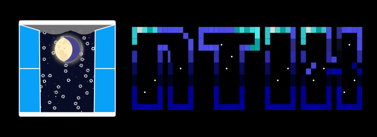
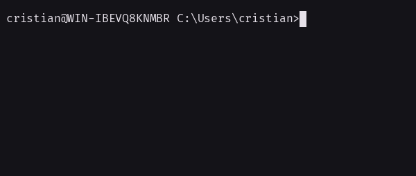

# NTIX

**nix-like package management for Windows.**

Declare your desired packages in Lua. NTIX figures out what to install, upgrade, and remove across winget, Chocolatey, and Scoop, plus arbitrary config files (dotfiles, settings) managed declaratively.



[Read the docs](https://cristiandis.gitbook.io/ntix) · [Quick Start](https://cristiandis.gitbook.io/ntix/quick-start) · [Report a Bug](https://github.com/Cristiandis/NTIX/issues)

## Quick Start

1. [Install NTIX](https://cristiandis.gitbook.io/ntix/quick-start) or [build from source](https://cristiandis.gitbook.io/ntix/contributing)
2. Create a `config.lua`:

```lua
local options = {
    winget = { enable = true, acceptAgreements = true },
    chocolatey = { enable = true, yes = true },
    scoop = { enable = true, buckets = { "main", "extras" } }
}

local pkgs = {}
pkgs.winget = { "Google.Chrome", "7zip.7zip" }
pkgs.chocolatey = { "ripgrep" }
pkgs.scoop = { "fd", "bat" }

return { options = options, pkgs = pkgs }
```

3. `ntix diff config.lua` — preview what would change
4. `ntix apply config.lua` — apply changes (requires admin)

## Roadmap

- ~~**Arbitrary config files** — manage dotfiles, shell configs, and system settings declaratively (like NixOS Home Manager)~~ Added in v2.1.0
- **Windows optional features** — enable/disable Hyper-V, OpenSSH, WSL, and other Windows features
- **Nix-shells** — temporary environments with specific packages for your current session

## License

Copyright © 2026 Cristian Izzo. Licensed under LGPLv2.1, see [LICENSE](LICENSE).
Branding assets are licensed under [CC BY 4.0](branding/LICENSE).

## Support the Project

If you find this useful, here are a few ways to help out - pick whichever fits:

1. **Contribute** — open a PR, fix a bug, improve the docs, or tackle an [open issue](https://github.com/Cristiandis/NTIX/issues).
2. **Donate** — if the project saves you time or money, consider [sponsoring](https://ko-fi.com/S6S11IXK2X) to help cover dev time.
3. **Spread the word** — star the repo, share it, or mention it to someone who might find it useful.

Every bit helps keep this maintained. Thanks for using it! 🙏
