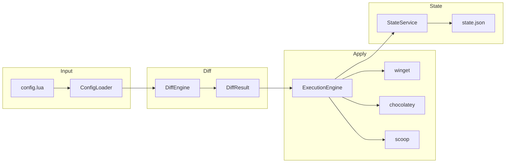

# How It Works

## How It Works

### Pipeline



### ConfigLoader

Reads a Lua script and evaluates it using [mlua](https://github.com/mlua-rs/mlua) with an embedded Lua 5.4 runtime. The config file must return a table with `options` and `pkgs` keys.

The loader supports:

* `import()` - include other Lua files, with automatic merging and deduplication
* Relative path resolution - imports are resolved relative to the importing file
* Deep merging - options tables are merged recursively; package arrays are deduplicated by ID (last wins)

### DiffEngine

Compares the desired state (config) against the current state (installed packages + NTIX state file) to produce a `DiffResult` with these lists:

| List | Meaning |
| ---- | ------- |
| `to_install` | Packages in config but not yet installed (or version mismatch) |
| `to_upgrade` | Unpinned packages with a newer version available (only with `--upgrade`) |
| `to_adopt` | Installed packages not yet tracked by NTIX (only with `--adopt`) |
| `to_untracked` | Installed packages not tracked by NTIX (informational only) |
| `to_skip` | Packages already at the desired version |
| `to_remove` | Packages tracked by NTIX but no longer in config (orphans) |
| `buckets_to_add` | Scoop buckets configured but not present on the system |
| `buckets_to_remove` | Scoop buckets tracked by NTIX but no longer configured |

Config-file actions (`config_files_to_create`, `config_files_to_update`, `config_files_no_longer_managed`) are computed separately, only when the caller opts in with `-c`/`--apply-configs`.

In addition, `warnings` collects non-fatal notes such as a manager being enabled but not installed, or a package that could not be verified.

Before listing packages, NTIX validates that they exist in their respective managers. A package **confirmed not to exist** is removed from `to_install` and added to `warnings`; a package that **cannot be verified** (for example a failed search query) is kept in `to_install` but flagged with a warning.

### State Management

NTIX tracks what it manages in a JSON state file at `%LOCALAPPDATA%/ntix/state.json`.

```json
{
  "version": 2,
  "winget": { "Google.Chrome": "latest", "7zip.7zip": "23.01" },
  "chocolatey": { "ripgrep": "latest" },
  "scoop": { "fd": "latest", "bat": "latest" },
  "scoopBuckets": { "main": null },
  "configFiles": { "C:/Users/you/.gitconfig": "9f86d081884c7d65..." }
}
```

* **Atomic writes** - state is written to a temp file then moved into place, preventing corruption
* **Orphan detection** - packages in the state file but not in the config are marked for removal
* **Retry logic** - file writes retry (with linear backoff) up to 3 times on failure
* **Scoop buckets** - buckets added by NTIX are recorded under `scoopBuckets`
* **Config files** - managed files are recorded under `configFiles`, keyed by destination path and valued by content hash

### Lock File

Only one `ntix apply` can run at a time. A lock file at `%LOCALAPPDATA%/ntix/apply.lock` prevents concurrent execution. On Windows it is opened with no sharing, so a second process fails to acquire it. The lock file stores `PID@UnixTimestamp`; if a lock is stale, the error message names the file so it can be deleted manually.

### Package Manager Detection

NTIX uses `PackageManagerDetector` to probe which managers are available:

* winget - checked and auto-installed via the App Installer if missing and enabled
* Chocolatey - probed by running `choco --version`
* Scoop - probed by running `scoop --version`
