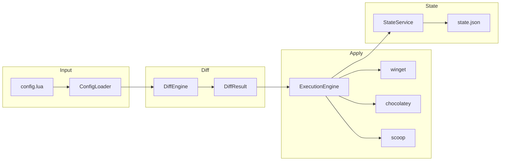

# How It Works

## How It Works

### Pipeline



### ConfigLoader

Reads a Lua script and evaluates it using [LuaCSharp](https://github.com/nuskey8/Lua-CSharp). The config file must return a table with `options` and `pkgs` keys.

The loader supports:

* `import()` - include other Lua files, with automatic merging and deduplication
* Relative path resolution - imports are resolved relative to the importing file
* Deep merging - options tables are merged recursively; package arrays are deduplicated by ID (last wins)

### DiffEngine

Compares the desired state (config) against the current state (installed packages + NTIX state file) to produce a `DiffResult` with five lists:

| List        | Meaning                                                                      |
| ----------- | ---------------------------------------------------------------------------- |
| `ToInstall` | Packages in config but not yet installed (or version mismatch)               |
| `ToUpgrade` | Unpinned packages with a newer version available (only with `--upgrade`)      |
| `ToAdopt`   | Installed packages not yet tracked by NTIX (only with `--adopt`)              |
| `ToSkip`    | Packages already at the desired version                                      |
| `ToRemove`  | Packages tracked by NTIX but no longer in config (orphans)                   |

Before computing the diff, NTIX validates that packages exist in their respective managers. Invalid packages are removed from `ToInstall` and added to `Warnings`.

### State Management

NTIX tracks what it manages in a JSON state file at `%LOCALAPPDATA%/ntix/state.json`.

```json
{
  "version": 1,
  "winget": { "Google.Chrome": "latest", "7zip.7zip": "23.01" },
  "chocolatey": { "ripgrep": "latest" },
  "scoop": { "fd": "latest", "bat": "latest" }
}
```

* **Atomic writes** - state is written to a temp file then moved into place, preventing corruption
* **Orphan detection** - packages in the state file but not in the config are marked for removal
* **Retry logic** - file writes retry up to 3 times on failure

### Lock File

Only one `ntix apply` can run at a time. A lock file at `%LOCALAPPDATA%/ntix/.lock` prevents concurrent execution. Stale locks (from crashed processes) are automatically detected and recovered.
