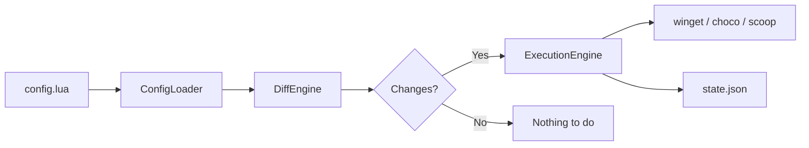

# Introduction

## What is NTIX?

NTIX is a declarative package management tool for Windows. Instead of manually installing packages across multiple package managers, you describe your desired state in a Lua configuration file and let NTIX handle the rest.

### Why NTIX?

Windows developers often use a mix of package managers, like winget for Microsoft Store apps, Chocolatey for system utilities, and Scoop for developer tools. Each has its own syntax, its own update mechanism, and its own way of tracking what's installed.

NTIX unifies them under one config:

* **One config file** describes all your packages across all managers
* **Diff preview** shows exactly what will change before you commit
* **State tracking** remembers what NTIX installed so it can clean up orphans
* **Pinned versions** keep critical packages at specific versions
* **Environment switching** lets you have different configs for work, personal, and CI

### How it works

1. **ConfigLoader** reads your Lua config and parses options + packages
2. **DiffEngine** compares your config against the current state (installed packages + NTIX state file)
3. **ExecutionEngine** applies the diff - installing, upgrading, or removing packages as needed
4. **StateService** persists what was done so the next run knows what NTIX manages

### Package managers

| Manager        | Best for                             | Example packages                              |
| -------------- | ------------------------------------ | --------------------------------------------- |
| **winget**     | Microsoft Store apps, large software | `Google.Chrome`, `Microsoft.VisualStudioCode` |
| **Chocolatey** | System utilities, admin tools        | `ripgrep`, `docker-desktop`                   |
| **Scoop**      | Developer CLI tools                  | `fd`, `bat`, `neovim`, `go`                   |

You can use one, two, or all three managers. NTIX only touches the managers you enable in your config.

